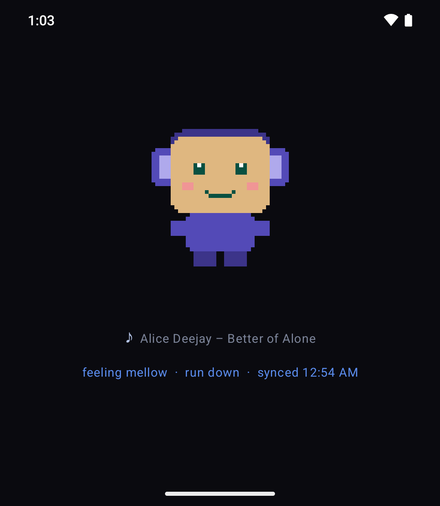
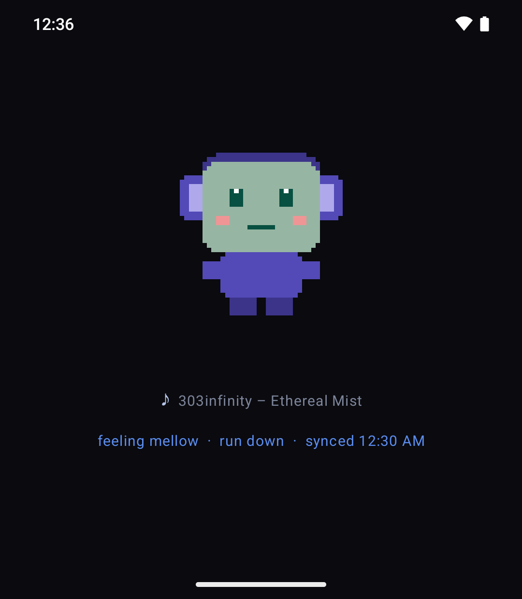
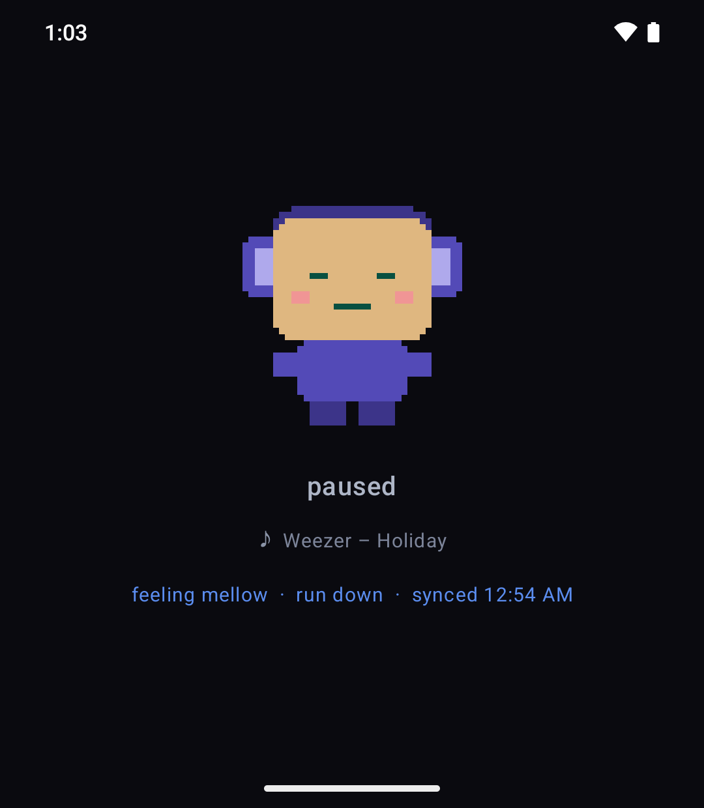
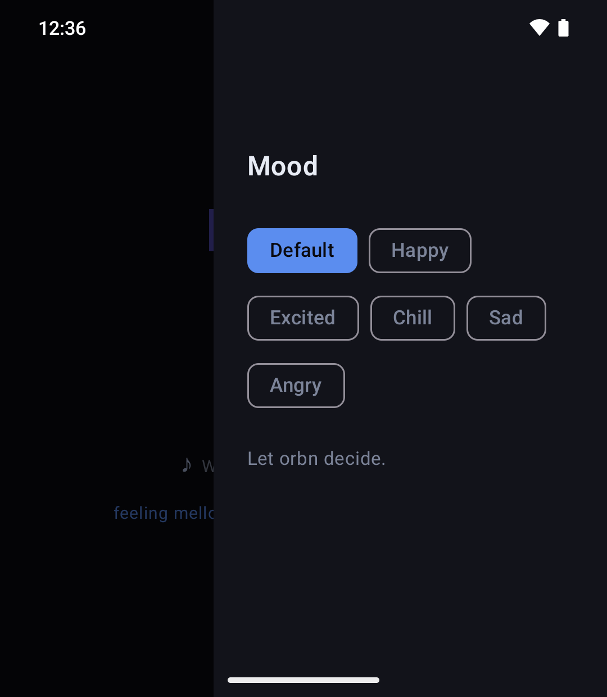
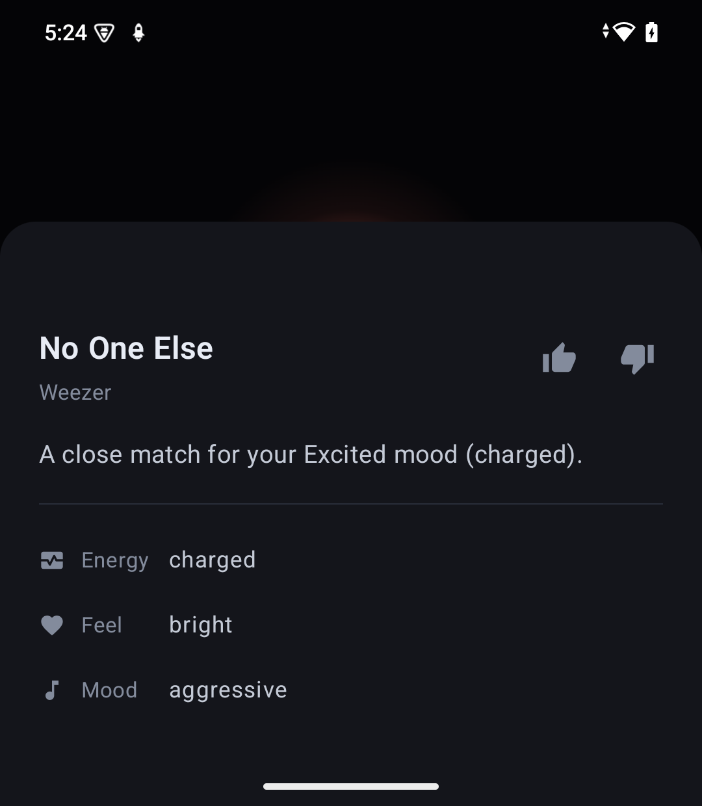
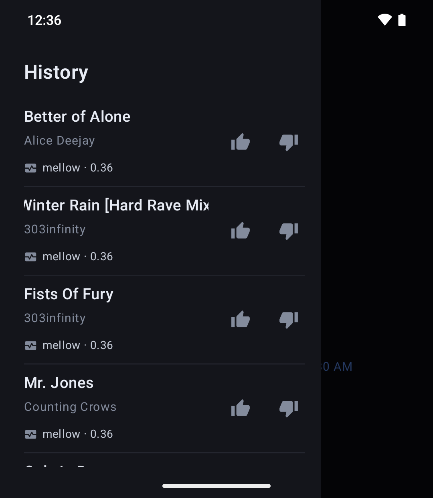
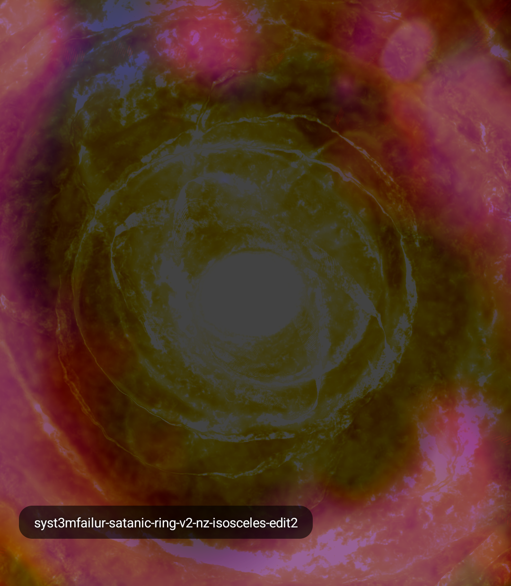
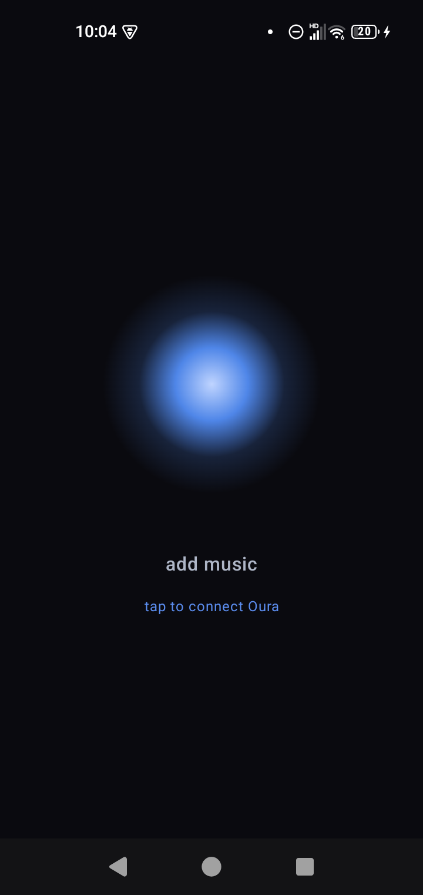
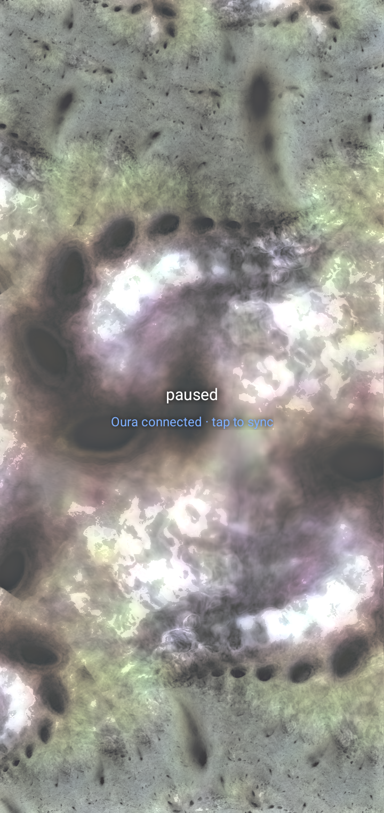

<div align="center">

# orbn


**music that matches how your body feels**

A mobile app that plays music based on the vibes of your fitness data. Originally built for the [iKKO MindOne](https://ikko.com/), it
runs on any Android phone using data from your Oura Ring.
It reads your biometrics, understands the *feel* of your own
music library, and plays what fits — with a full-screen, nostalgic Winamp visualizer.

</div>

---

## What is orbn?

Most "mood" players use a music streaming service and react to a single number like heart rate.
orbn is different on three counts:

- **It plays *your* music** — the local files you own, not a streaming service.
- **It understands how you are** — using your Oura Ring's overnight recovery/HRV as a daily
  baseline, nudged by your heart rate and movement through the day.
- **It runs entirely on the device** — analysis, matching, and visuals all happen locally on your
  phone. orbn has no backend and no account of its own; the only thing it ever fetches is your own
  readings from Oura's API, and nothing about your music or listening leaves the device.

Under the hood, orbn analyzes each song once (tempo, key, energy, mood, genre) and places it in a
simple *valence–energy* space. Your biometric state becomes a target point in that same space, and
orbn plays the tracks that fit — then renders them with visuals you can just stare at.

**No Oura Ring, or don't want to connect one?** orbn still works. Pick a **mood** and it matches songs
to that feel instead of your biometrics. Either way it only ever plays the local music you've added to
the device.

The moods:

- **Default** — no override; follow your Oura state (or a neutral feel if there's no ring).
- **Happy** — bright, upbeat.
- **Excited** — fast, high-energy — any feeling.
- **Chill** — mellow, and **instrumental only** (no lyrics) — made for focus and background listening.
- **Sad** — slower, downbeat.
- **Angry** — dark, intense, high-energy.

## The story

Why iKKO MindOne? I backed it on Kickstarter in August 2025 because I love small phones and I was looking 
to replace my Jelly Star. What arrived nine months later was a device without Google Play Services, no 
OTA updates, and no real path to being a normal phone. Rather than fight for a refund I couldn't get, I was
inspired by cyberdecks and decided to turn this into a music player with no distractions that can read my "mood".

Normally, I would not have had the time to build this but I recently started a career break that began in June 2026 
and orbn began as an idle whim during the break and snowballed into being my first project during this time. It's partly 
a thing I genuinely want to use, partly a mechanism to learn in the open. If it's useful or interesting to anyone else, all the better. 

I wrote a longer piece on [my LinkedIn](https://www.linkedin.com/feed/update/urn:li:activity:7467651824775266304/) about how I 
spent almost 10 years at Twitch and left due to personal reasons, mostly health and general burnout.

If the idea of a music player that actually knows how you're doing seems neat to you, I'd appreciate your support:

- [GitHub Sponsors](https://github.com/sponsors/earlyspark)
- [Buy me a coffee](https://buymeacoffee.com/earlyspark)

## The device

orbn was originally built for the iKKO MindOne: a small, near-square Android 15 device with a Cirrus Logic DAC,
no Google services, and a focus on audio. The goal is a standalone, glanceable music player you live
inside — with the occasional check of your Oura data.

But **it isn't MindOne-only.** orbn is written as a general Android app and **also runs on other Android
phones** (verified on a tall, standard-aspect device) — anything device-specific (like the MindOne's
DAC tuning) degrades gracefully. Any Android + Oura Ring user can run it, not just iKKO owners.

## How it works (high level)

```
your music files ──► on-device analysis (tempo / key / energy / mood / genre)
                                   │
Oura Ring ──► daily recovery + intra-day heart rate & movement ──► "how you are" right now
                                   │
                     match in a valence–energy space
                                   │
                 play fitting tracks ──► full-screen reactive visualizer
```

## Tech & privacy

- **Kotlin + Jetpack Compose**, Android NDK for the native pipeline.
- On-device audio analysis and machine-learning inference for tagging.
- A MilkDrop-style visualizer for the now-playing experience.
- The Oura Web API for biometric data.
- **Privacy by design:** everything runs locally. Your listening and biometric data stay on the
  device; orbn talks to the Oura API only to fetch *your own* data, and to nothing else.
  See the [Privacy Policy](PRIVACY.md) for the full picture.

## Building

orbn is an Android app. You'll need Android Studio (or the Android SDK + NDK) and JDK 17 or newer.

```bash
./scripts/fetch-native-deps.sh   # one-time: download prebuilt native deps (Essentia, ONNX Runtime, Eigen, projectM, models)
./gradlew :app:installDebug      # build and install on a connected device
```

The native dependencies are large prebuilt binaries kept out of git; the script fetches them
from a GitHub Release and unpacks them where the build expects.

### Installing it on your phone

There's **no prebuilt APK to download** — orbn is distributed as source, so you build your own from
this repo. (That's partly by design: the app uses *your own* Oura credentials — see
[Connecting Oura](#connecting-oura) — and building it yourself is what keeps those yours.) Once you've
done the one-time setup above, there are two ways to get your build onto the phone:

- **Straight from your computer (simplest):** turn on **Developer options** (Settings → About → tap
  *Build number* seven times) and enable **USB** (or **Wireless**) **debugging**, connect the phone,
  and run `./gradlew :app:installDebug` — it compiles and installs in one step.
- **As a standalone file:** run `./gradlew :app:assembleDebug` to produce an APK at
  `app/build/outputs/apk/debug/app-arm64-v8a-debug.apk`, copy it to the phone, and tap it to install.
  The first time, Android asks you to allow **"install unknown apps"** for whatever opened the file
  (your files app or browser) — that's the sideload prompt.

This is a debug build, which is fine for personal use.

### Adding your music

orbn plays the local files you own. There are two ways to get them in:

- **In-app (recommended, works on any phone):** tap **"add music"** on the home screen and pick the
  tracks from anywhere on your device — Downloads, internal storage, an SD card, or a cloud provider.
- **Manually:** copy audio files over USB into the app's folder at
  `Android/data/com.earlyspark.orbn/files/Music/`. Note that some phones hide `Android/data` from a
  computer's file browser — if you can't see it, use the in-app picker instead (or copy to your
  Downloads folder and import from there).

Either way, **orbn copies the files into its own folder** — your originals are never touched or
modified. Because they live inside the app, **uninstalling orbn deletes its copies** (re-importing is
quick). Supported: `mp3`, `flac`, `m4a`, `aac`, `ogg`, `wav`.

**How analysis works:** when you add music, orbn analyzes each track on-device — tempo, key, energy,
mood, and genre — and nothing is uploaded. The home screen and a notification show the progress
(`tagging your library… 3 / 12`), and a track becomes available to play once it's been analyzed. It's
CPU-heavy work — on the order of tens of seconds per track — so a large library tags itself in the
background over time (even while you listen), and it resumes automatically if interrupted.

### Connecting Oura

To use the biometric features you supply your **own** Oura developer app credentials — orbn ships
none. Register an application at [developer.ouraring.com/applications](https://developer.ouraring.com/applications)
with the redirect URI `com.earlyspark.orbn://oauth2redirect`, then add the values to
`local.properties` (which is gitignored and never committed):

```properties
OURA_CLIENT_ID=your_client_id
OURA_CLIENT_SECRET=your_client_secret
OURA_REDIRECT_URI=com.earlyspark.orbn://oauth2redirect
```

The build injects these into `BuildConfig` at compile time; they are never hardcoded in source.
Without them the app still builds and plays music — it just shows "Oura: add credentials" instead
of biometric data.

Once connected, orbn reads your data on app-open and at each track change (and on demand), showing
the time of the freshest reading. For this to stay current, **turn on background sync in the Oura
app** — your ring only reaches Oura's cloud through that app, so with background sync off orbn can
only see data from the last time you manually opened Oura.

## Visualizer presets

The bundled visualizer presets (a curated subset of projectM's Cream of the Crop) vary in how hard
they push the GPU. Measured on the MindOne (Dimensity 7050, ~90 Hz display):

| fps (best) | Preset | |
|---|---|---|
| 22 | `royal-mashup-244` | 🔴 heavy |
| 28 | `evet-flexi-x32-astroluxn777` | 🔴 heavy |
| 30 | `royal-mashup-257` | 🔴 heavy |
| 45 | `tripgnosis-goldenglowstick` | 🔴 heavy |
| 49 | `royal-mashup-276-isosceles-edit` | 🔴 heavy |
| 51 | `royal-mashup-287` | 🟡 borderline |
| 53 | `martin-n-adamfx-hardcore-mix-collision-in-myself` | 🟡 borderline |
| 60–72 | `suksma-kaeuldrone-disphignunt-sheviski`, `syst3mfailur-satanic-ring-v2-nz-isosceles-edit2`, `306-nz-ain-no-hoehoe`, `martin-underwater-cathedral-1`, `tonymilkdrop-nuclear-flexi-help-out-alien-comple`, `flexi-adamfx-geiss-and-rovastar-tokamak-tng-syne`, `suksma-mtn-flx-flacc-choilan-roam` | 🟢 fine\* |
| 75–92 | `flexi-rovastar-fractopia-blame-hexcollie`, `martin-lightning`, `271-nz`, `211-wave` | 🟢 smooth |

\* The 60–72 group is likely smoother in practice — each preset got only ~4 s in the sweep, so the
one-time shader-compile hitch on switching dragged its average; with a longer dwell several of these
sit near 80 fps.

**Keeping a heavy preset is low-risk** — it won't crash, freeze, harm the device, or stall audio; the
cost is just choppier visuals plus more battery and heat, and on a small fanless phone a heavy preset
over a long session can warm the device and thermal-throttle (it self-protects — no damage). To drop
one, delete its `.milk` file from `app/src/main/assets/presets/` and rebuild.

## Roadmap

On-device music analysis → background tagging of your library → playback → Oura integration →
biometric matching → the full-screen reactive visualizer → a manual mood picker ✅ **— v1, done**
— → **refinement & bug-fixing (next)** → more.

## Status

✅ **v1 is feature-complete: the full loop works end to end — it reads your body, plays music to match,
and visualizes it.** On real hardware, orbn scans and analyzes your library entirely on-device (tempo,
key, energy, mood, genre), connects to your Oura Ring to read your recovery, heart rate, and movement
into a "how you are right now" signal, and **builds a play queue that fits that signal** — sampled
for variety, ordered to flow, and mindful of what you've recently played so it doesn't repeat. Pull
down to re-tune the queue to right now, or **swipe to set a mood** (happy, chill, sad, excited…) when
you want to override what your body says and pick the feel yourself. Now-playing is a **full-screen
MilkDrop-style visualizer (projectM) that reacts to the live audio** — tap to play/pause, double-tap to
change the visual (a library of presets you cycle through), long-press to exit. Plays back hi-res to the
iKKO's DAC when the case is attached. From here, it's refinement — polish, QA, and tuning how well
songs match your state.

## Demo & screenshots

<div align="center">

<a href="https://www.youtube.com/shorts/I9N_934KL6s">
  
</a>

**▶ [Watch the demo](https://www.youtube.com/shorts/I9N_934KL6s)**

> 📝 How it was built: [*I built a mobile app with Claude Code in 4 days*](https://blog.earlyspark.com/p/i-built-a-mobile-app-with-claude)

<br>

<table>
<tr>
<td align="center"><br><sub><b>Home</b> — your state at a glance</sub></td>
<td align="center"><br><sub><b>Mood color</b> — shifts with your energy</sub></td>
<td align="center"><br><sub><b>Paused</b> — dozes when the music stops</sub></td>
</tr>
<tr>
<td align="center"><br><sub><b>Mood</b> — override the vibe</sub></td>
<td align="center"><br><sub><b>Why this track</b> — the read behind the pick</sub></td>
<td align="center"><br><sub><b>History</b> — rate past picks</sub></td>
</tr>
<tr>
<td align="center" colspan="3"><br><sub><b>Visualizer</b> — full-screen &amp; audio-reactive</sub></td>
</tr>
</table>

**Runs on any Android phone, not just the MindOne** — here on a Jelly Max:

<table>
<tr>
<td align="center"><br><sub><b>First run</b> — add music, connect Oura</sub></td>
<td align="center"><br><sub><b>Visualizer</b> — same experience, different device</sub></td>
</tr>
</table>

</div>

## Author

Built by RayAna ([@earlyspark](https://github.com/earlyspark)).

## License

orbn is licensed under the **[GNU Affero General Public License v3.0](LICENSE)** (AGPLv3).
You're free to use, study, modify, and share it — but any distributed or network-deployed
derivative must also be open-sourced under AGPLv3. As the sole copyright holder, the author
can grant separate commercial licenses on request.

Copyright © 2026 RayAna ([@earlyspark](https://github.com/earlyspark)).

## Acknowledgements

Standing on the shoulders of open source — including [Essentia](https://essentia.upf.edu/)
(audio analysis), [ONNX Runtime](https://onnxruntime.ai/) (on-device inference), and
[projectM](https://github.com/projectM-visualizer/projectm) (MilkDrop-style visuals). The bundled
visualizer presets are a curated subset of projectM's
[Cream of the Crop](https://github.com/projectM-visualizer/presets-cream-of-the-crop) pack
(community MilkDrop presets).
